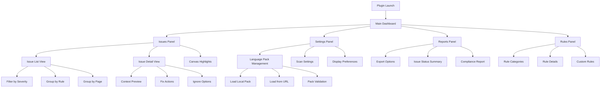
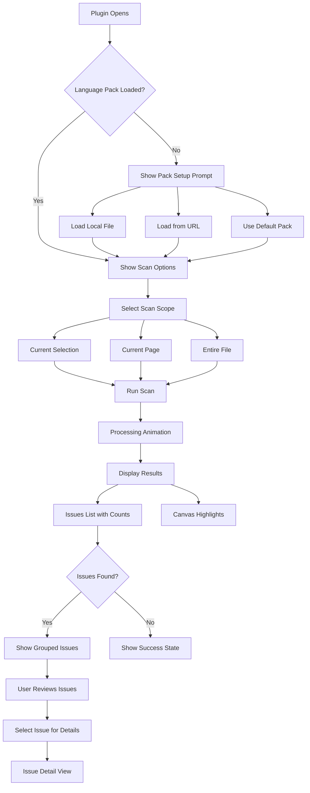
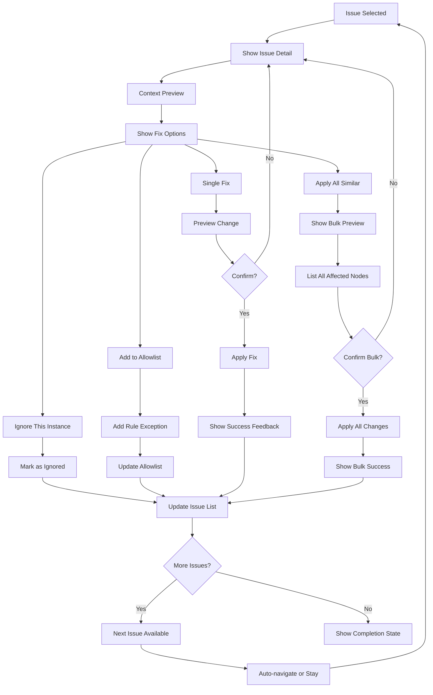
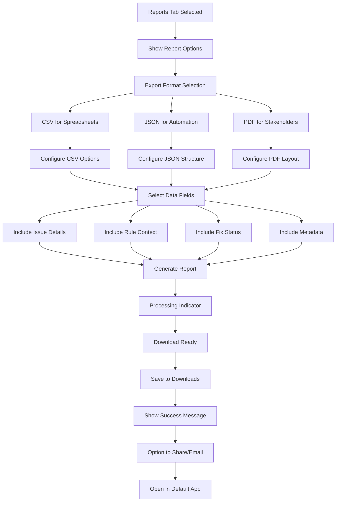

# Figma Language Consistency Plugin UI/UX Specification

This document defines the user experience goals, information architecture, user flows, and visual design specifications for Figma Language Consistency Plugin's user interface. It serves as the foundation for visual design and frontend development, ensuring a cohesive and user-centered experience.

## Overall UX Goals & Principles

### Target User Personas

- **Professional Designers:** Need efficient validation during active design work with minimal learning curve
- **UX Writers:** Require comprehensive review tools with detailed context and batch capabilities
- **Localization/Brand Teams:** Need policy enforcement tools with audit trails and compliance reporting
- **International Teams:** Working across multiple locales with varying language expertise levels

### Usability Goals

- **Immediate feedback:** Issues highlighted in ≤ 2 seconds with visual severity indicators
- **Efficient resolution:** 80% of common fixes completable in ≤ 3 clicks with keyboard shortcuts available
- **Non-disruptive integration:** Plugin operates without interrupting design flow or requiring context switching
- **Progressive expertise:** Novice users get educational guidance, experts get streamlined workflows
- **Privacy transparency:** All data processing clearly explained with user control over sharing

### Design Principles

1. **Privacy by design** - Local processing with clear data handling transparency (Priority 1)
2. **Contextual clarity** - Issues shown with visual severity hierarchy and clear explanations (Priority 1)  
3. **Efficient triage** - Rapid decision-making through keyboard navigation and bulk operations (Priority 2)
4. **Progressive disclosure** - Educational details available but not required for expert users (Priority 2)
5. **Respectful workflow integration** - Highlight issues without overwhelming the canvas or disrupting flow (Priority 3)

### Change Log

| Date | Version | Description | Author |
|------|---------|-------------|---------|
| 2025-01-12 | 1.0 | Initial UI/UX specification | Sally (UX Expert) |

## Information Architecture (IA)

### Site Map / Screen Inventory

### Navigation Structure

**Primary Navigation:** Tab-based interface with four main sections: Issues (default), Rules, Settings, Reports. Tab badges show issue counts and status indicators.

**Secondary Navigation:** Within each tab, contextual filters and grouping options. Issues tab includes severity filters, page selectors, and search. Settings includes collapsible sections for different configuration types.

**Breadcrumb Strategy:** Minimal breadcrumbs due to shallow hierarchy. Context maintained through tab state and selected filters. Issue detail views show "Back to Issues" with preserved filter state.

## User Flows

### Scan and Discovery Flow

**User Goal:** Quickly identify language consistency issues in current design work

**Entry Points:** 
- Plugin launch (default action)
- Manual scan trigger after text changes
- Auto-scan on typing (if enabled in settings)

**Success Criteria:** User sees comprehensive issue list with clear priorities and can understand scope of work needed

#### Flow Diagram

#### Edge Cases & Error Handling:
- No language pack configured: Show setup wizard with sample pack option
- Scan timeout on large files: Show progress with cancel option, paginated results
- Network failure for URL pack: Fallback to cached pack with warning
- No text nodes found: Show informative empty state with scan scope tips
- Parsing errors in pack: Show validation errors with specific line numbers

**Notes:** The flow prioritizes getting users to results quickly while handling the complexity of pack management gracefully. Auto-scan is opt-in to avoid disrupting design flow.

### Fix and Resolution Flow

**User Goal:** Efficiently resolve language issues with confidence and ability to undo

**Entry Points:**
- Click on issue in list
- Click on canvas highlight
- Keyboard navigation through issues

**Success Criteria:** User can apply fixes individually or in bulk with clear feedback and full undo capability

#### Flow Diagram

#### Edge Cases & Error Handling:
- Fix conflicts with other rules: Show warning with options to proceed or review
- Node deleted during fix process: Show error and refresh issue list
- Undo limit reached: Warn user before applying bulk changes
- Network interruption during pack sync: Allow offline fixes with sync on reconnect
- Invalid replacement text: Validate before applying and show specific error

**Notes:** The flow balances efficiency (bulk operations) with safety (preview and confirm). Keyboard shortcuts enable rapid triage for power users.

### Reporting and Export Flow

**User Goal:** Generate compliance reports and export issue data for team review or documentation

**Entry Points:**
- Reports tab in plugin
- Export button in issue list
- Scheduled export (future feature)

**Success Criteria:** User gets formatted report with all necessary context for stakeholder review and compliance tracking

#### Flow Diagram

#### Edge Cases & Error Handling:
- Large report generation timeout: Show progress with streaming download option
- File save permission denied: Offer alternative save locations or clipboard copy
- Empty report (no issues): Show informative message with scan suggestions
- Corrupted export data: Validate before download and show retry option
- Browser download blocked: Provide manual download link and instructions

**Notes:** The export flow accommodates different stakeholder needs (technical JSON, executive PDF, analyst CSV) while maintaining data integrity and providing clear status feedback.

## Wireframes & Mockups

**Primary Design Files:** Wireframes and detailed mockups will be created in Figma itself, leveraging the plugin development environment for rapid prototyping and testing

### Key Screen Layouts

#### Enhanced Main Dashboard (Issues Tab)

**Purpose:** Transform language checking into an efficient, satisfying workflow experience

**Key Elements:**
- **Smart header** with scan status, progress indicator, and completion score
- **Adaptive filter bar** with severity chips and smart presets ("Quick Wins", "Critical Only")
- **Hybrid issue list** with compact rows that expand to show context on hover/select
- **Contextual preview panel** with before/after comparison and rule explanation
- **Gamified progress** showing completion percentage and streak indicators

**Interaction Notes:** 
- **Keyboard-first navigation**: J/K for navigation, A for apply, I for ignore, Space for preview
- **Smart bulk selection**: Ctrl+A selects all "quick wins", Shift+click for range selection
- **Contextual learning**: Hover over rule names shows educational tooltips with examples
- **Visual feedback**: Subtle animations for applied fixes, progress bar updates

**Innovation Elements:**
- **Issue clustering**: Similar issues grouped with "Apply All" option prominently displayed
- **Risk indicators**: Green/yellow/red borders with confidence scores for fixes
- **Learning mode toggle**: Detailed explanations for new users, streamlined for experts

**Design File Reference:** [Enhanced Dashboard Wireframe - to be created in Figma]

#### Focused Issue Resolution View

**Purpose:** Make individual issue resolution feel confident and educational

**Key Elements:**
- **Split-pane layout**: Original text on left, suggested fix on right with diff highlighting
- **Rule context card**: Why this rule matters with real-world examples
- **Confidence indicator**: Visual representation of fix reliability
- **Action buttons** with keyboard shortcuts clearly labeled
- **Navigation breadcrumb**: "Issue 3 of 12" with progress indication

**Interaction Notes:**
- **Preview animation**: Smooth transition showing text change
- **One-click workflows**: "Apply and Next" for rapid triage
- **Undo visibility**: Clear indication of undo availability
- **Context preservation**: Maintains filter/sort state when returning to list

**Design File Reference:** [Issue Resolution Modal - to be created in Figma]

#### Intelligent Settings Panel

**Purpose:** Configuration that learns and adapts to user behavior

**Key Elements:**
- **Usage-based recommendations**: "You often ignore spacing rules - adjust sensitivity?"
- **Visual pack preview**: Sample text showing how rules apply
- **Smart defaults section**: Auto-apply settings based on user patterns
- **Workflow integration toggles**: Scan triggers and notification preferences
- **Privacy dashboard**: Clear data handling controls with usage statistics

**Interaction Notes:**
- **Live preview**: Settings changes show immediate effect on sample text
- **Smart suggestions**: Recommend pack updates based on usage patterns
- **Onboarding integration**: Progressive disclosure of advanced features
- **Export settings**: Share configuration with team members

**Design File Reference:** [Adaptive Settings Interface - to be created in Figma]

#### Analytics-Driven Reports Dashboard

**Purpose:** Transform compliance reporting into actionable insights

**Key Elements:**
- **Visual issue trends**: Charts showing improvement over time
- **Team performance metrics**: Comparative analytics for team leads
- **Rule effectiveness scores**: Which rules catch the most issues
- **Export wizard**: Step-by-step report generation with templates
- **Actionable insights**: "Most common issues" with improvement suggestions

**Interaction Notes:**
- **Interactive charts**: Click to drill down into specific time periods or rules
- **Template library**: Pre-configured reports for different stakeholders
- **Scheduled exports**: Set up recurring reports with email delivery
- **Sharing integration**: Direct links to reports with access controls

**Design File Reference:** [Analytics Dashboard Layout - to be created in Figma]

