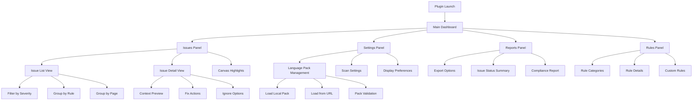
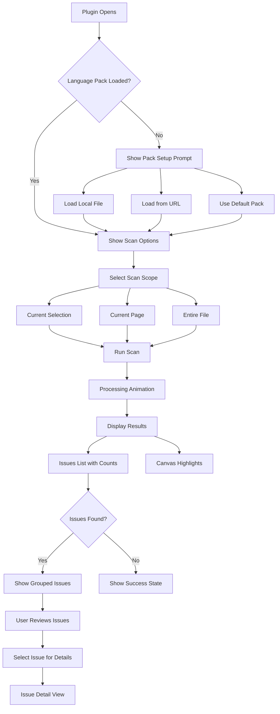
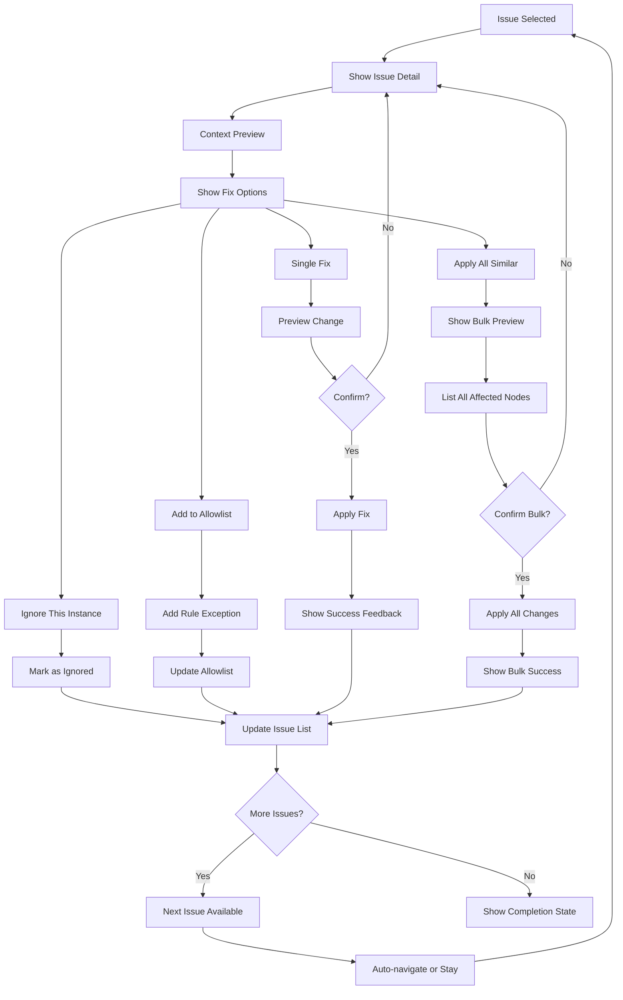
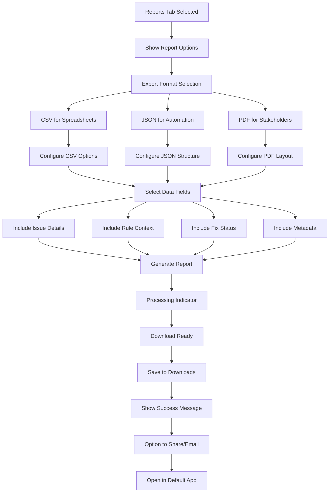

# Figma Language Consistency Plugin UI/UX Specification

This document defines the user experience goals, information architecture, user flows, and visual design specifications for Figma Language Consistency Plugin's user interface. It serves as the foundation for visual design and frontend development, ensuring a cohesive and user-centered experience.

## Overall UX Goals & Principles

### Target User Personas

- **Professional Designers:** Need efficient validation during active design work with minimal learning curve
- **UX Writers:** Require comprehensive review tools with detailed context and batch capabilities
- **Localization/Brand Teams:** Need policy enforcement tools with audit trails and compliance reporting
- **International Teams:** Working across multiple locales with varying language expertise levels

### Usability Goals

- **Immediate feedback:** Issues highlighted in ≤ 2 seconds with visual severity indicators
- **Efficient resolution:** 80% of common fixes completable in ≤ 3 clicks with keyboard shortcuts available
- **Non-disruptive integration:** Plugin operates without interrupting design flow or requiring context switching
- **Progressive expertise:** Novice users get educational guidance, experts get streamlined workflows
- **Privacy transparency:** All data processing clearly explained with user control over sharing

### Design Principles

1. **Privacy by design** - Local processing with clear data handling transparency (Priority 1)
2. **Contextual clarity** - Issues shown with visual severity hierarchy and clear explanations (Priority 1)  
3. **Efficient triage** - Rapid decision-making through keyboard navigation and bulk operations (Priority 2)
4. **Progressive disclosure** - Educational details available but not required for expert users (Priority 2)
5. **Respectful workflow integration** - Highlight issues without overwhelming the canvas or disrupting flow (Priority 3)

### Change Log

| Date | Version | Description | Author |
|------|---------|-------------|---------|
| 2025-01-12 | 1.0 | Initial UI/UX specification | Sally (UX Expert) |

## Information Architecture (IA)

### Site Map / Screen Inventory

### Navigation Structure

**Primary Navigation:** Tab-based interface with four main sections: Issues (default), Rules, Settings, Reports. Tab badges show issue counts and status indicators.

**Secondary Navigation:** Within each tab, contextual filters and grouping options. Issues tab includes severity filters, page selectors, and search. Settings includes collapsible sections for different configuration types.

**Breadcrumb Strategy:** Minimal breadcrumbs due to shallow hierarchy. Context maintained through tab state and selected filters. Issue detail views show "Back to Issues" with preserved filter state.

## User Flows

### Scan and Discovery Flow

**User Goal:** Quickly identify language consistency issues in current design work

**Entry Points:** 
- Plugin launch (default action)
- Manual scan trigger after text changes
- Auto-scan on typing (if enabled in settings)

**Success Criteria:** User sees comprehensive issue list with clear priorities and can understand scope of work needed

#### Flow Diagram

#### Edge Cases & Error Handling:
- No language pack configured: Show setup wizard with sample pack option
- Scan timeout on large files: Show progress with cancel option, paginated results
- Network failure for URL pack: Fallback to cached pack with warning
- No text nodes found: Show informative empty state with scan scope tips
- Parsing errors in pack: Show validation errors with specific line numbers

**Notes:** The flow prioritizes getting users to results quickly while handling the complexity of pack management gracefully. Auto-scan is opt-in to avoid disrupting design flow.

### Fix and Resolution Flow

**User Goal:** Efficiently resolve language issues with confidence and ability to undo

**Entry Points:**
- Click on issue in list
- Click on canvas highlight
- Keyboard navigation through issues

**Success Criteria:** User can apply fixes individually or in bulk with clear feedback and full undo capability

#### Flow Diagram

#### Edge Cases & Error Handling:
- Fix conflicts with other rules: Show warning with options to proceed or review
- Node deleted during fix process: Show error and refresh issue list
- Undo limit reached: Warn user before applying bulk changes
- Network interruption during pack sync: Allow offline fixes with sync on reconnect
- Invalid replacement text: Validate before applying and show specific error

**Notes:** The flow balances efficiency (bulk operations) with safety (preview and confirm). Keyboard shortcuts enable rapid triage for power users.

### Reporting and Export Flow

**User Goal:** Generate compliance reports and export issue data for team review or documentation

**Entry Points:**
- Reports tab in plugin
- Export button in issue list
- Scheduled export (future feature)

**Success Criteria:** User gets formatted report with all necessary context for stakeholder review and compliance tracking

#### Flow Diagram

#### Edge Cases & Error Handling:
- Large report generation timeout: Show progress with streaming download option
- File save permission denied: Offer alternative save locations or clipboard copy
- Empty report (no issues): Show informative message with scan suggestions
- Corrupted export data: Validate before download and show retry option
- Browser download blocked: Provide manual download link and instructions

**Notes:** The export flow accommodates different stakeholder needs (technical JSON, executive PDF, analyst CSV) while maintaining data integrity and providing clear status feedback.

## Wireframes & Mockups

**Primary Design Files:** Wireframes and detailed mockups will be created in Figma itself, leveraging the plugin development environment for rapid prototyping and testing

### Key Screen Layouts

#### Enhanced Main Dashboard (Issues Tab)

**Purpose:** Transform language checking into an efficient, satisfying workflow experience

**Key Elements:**
- **Smart header** with scan status, progress indicator, and completion score
- **Adaptive filter bar** with severity chips and smart presets ("Quick Wins", "Critical Only")
- **Hybrid issue list** with compact rows that expand to show context on hover/select
- **Contextual preview panel** with before/after comparison and rule explanation
- **Gamified progress** showing completion percentage and streak indicators

**Interaction Notes:** 
- **Keyboard-first navigation**: J/K for navigation, A for apply, I for ignore, Space for preview
- **Smart bulk selection**: Ctrl+A selects all "quick wins", Shift+click for range selection
- **Contextual learning**: Hover over rule names shows educational tooltips with examples
- **Visual feedback**: Subtle animations for applied fixes, progress bar updates

**Innovation Elements:**
- **Issue clustering**: Similar issues grouped with "Apply All" option prominently displayed
- **Risk indicators**: Green/yellow/red borders with confidence scores for fixes
- **Learning mode toggle**: Detailed explanations for new users, streamlined for experts

**Design File Reference:** [Enhanced Dashboard Wireframe - to be created in Figma]

#### Focused Issue Resolution View

**Purpose:** Make individual issue resolution feel confident and educational

**Key Elements:**
- **Split-pane layout**: Original text on left, suggested fix on right with diff highlighting
- **Rule context card**: Why this rule matters with real-world examples
- **Confidence indicator**: Visual representation of fix reliability
- **Action buttons** with keyboard shortcuts clearly labeled
- **Navigation breadcrumb**: "Issue 3 of 12" with progress indication

**Interaction Notes:**
- **Preview animation**: Smooth transition showing text change
- **One-click workflows**: "Apply and Next" for rapid triage
- **Undo visibility**: Clear indication of undo availability
- **Context preservation**: Maintains filter/sort state when returning to list

**Design File Reference:** [Issue Resolution Modal - to be created in Figma]

#### Intelligent Settings Panel

**Purpose:** Configuration that learns and adapts to user behavior

**Key Elements:**
- **Usage-based recommendations**: "You often ignore spacing rules - adjust sensitivity?"
- **Visual pack preview**: Sample text showing how rules apply
- **Smart defaults section**: Auto-apply settings based on user patterns
- **Workflow integration toggles**: Scan triggers and notification preferences
- **Privacy dashboard**: Clear data handling controls with usage statistics

**Interaction Notes:**
- **Live preview**: Settings changes show immediate effect on sample text
- **Smart suggestions**: Recommend pack updates based on usage patterns
- **Onboarding integration**: Progressive disclosure of advanced features
- **Export settings**: Share configuration with team members

**Design File Reference:** [Adaptive Settings Interface - to be created in Figma]

#### Analytics-Driven Reports Dashboard

**Purpose:** Transform compliance reporting into actionable insights

**Key Elements:**
- **Visual issue trends**: Charts showing improvement over time
- **Team performance metrics**: Comparative analytics for team leads
- **Rule effectiveness scores**: Which rules catch the most issues
- **Export wizard**: Step-by-step report generation with templates
- **Actionable insights**: "Most common issues" with improvement suggestions

**Interaction Notes:**
- **Interactive charts**: Click to drill down into specific time periods or rules
- **Template library**: Pre-configured reports for different stakeholders
- **Scheduled exports**: Set up recurring reports with email delivery
- **Sharing integration**: Direct links to reports with access controls

**Design File Reference:** [Analytics Dashboard Layout - to be created in Figma]

## Component Library / Design System

**Design System Approach:** Hybrid approach leveraging Figma's native plugin UI patterns while extending with custom components for language-specific functionality. This ensures familiarity for Figma users while providing specialized interactions for text analysis and correction workflows.

### Core Components

#### Issue Card Component

**Purpose:** Display individual language issues with context and actions

**Variants:** 
- Compact (list view)
- Expanded (with preview)
- Selected (active state)

**States:** 
- Default, Hover, Selected, Resolved, Ignored, Error

**Usage Guidelines:** Use compact variant for lists with 10+ items. Expand on hover/selection to show context. Always include severity indicator and rule reference.

#### Severity Indicator Component

**Purpose:** Visual hierarchy for issue importance and urgency

**Variants:**
- Dot (minimal space)
- Badge (with text)
- Border (subtle indication)

**States:**
- Critical (red), Warning (amber), Info (blue), Success (green)

**Usage Guidelines:** Use consistently across all issue displays. Dot variant for compact lists, badge for detailed views, border for subtle indication in previews.

#### Fix Action Button Component

**Purpose:** Primary action interface for applying language corrections

**Variants:**
- Single fix, Bulk fix, Preview fix, Ignore fix

**States:**
- Default, Hover, Loading, Success, Error, Disabled

**Usage Guidelines:** Always pair with undo capability indicator. Use loading state for operations > 200ms. Group related actions visually.

#### Text Diff Display Component

**Purpose:** Show before/after comparison of text changes

**Variants:**
- Inline (small changes)
- Side-by-side (large changes)
- Highlighted (within context)

**States:**
- Preview, Applied, Reverted

**Usage Guidelines:** Use inline for single word changes, side-by-side for sentence changes, highlighted for showing position within larger text blocks.

#### Filter Chip Component

**Purpose:** Interactive filtering and categorization interface

**Variants:**
- Active, Inactive, Count badge, Removable

**States:**
- Default, Hover, Selected, Disabled

**Usage Guidelines:** Always show count when available. Use removable variant for user-created filters. Group by logical categories (severity, rule type, page).

## Branding & Style Guide

### Visual Identity

**Brand Guidelines:** Align with Figma's design language while establishing distinct identity for language consistency functionality. Emphasize clarity, precision, and trustworthiness through clean typography and purposeful color usage.

### Color Palette

#### Brand Colors (OKLCH)

| Color Type | OKLCH Value | Hex Equivalent | CSS Variable | Usage |
|------------|-------------|----------------|--------------|--------|
| **Primary** | oklch(0.68 0.16 240) | #0D99FF | --color-primary | Primary actions, links, focus states |
| Primary Light | oklch(0.85 0.10 240) | #7FC4FF | --color-primary-light | Hover states, backgrounds |
| Primary Dark | oklch(0.55 0.20 240) | #0066CC | --color-primary-dark | Active states, borders |
| **Secondary** | oklch(0.58 0.22 290) | #7C3AED | --color-secondary | Secondary actions, progress indicators |
| Secondary Light | oklch(0.75 0.15 290) | #A855F7 | --color-secondary-light | Hover states |
| Secondary Dark | oklch(0.45 0.25 290) | #5B21B6 | --color-secondary-dark | Active states |

#### Semantic Colors (OKLCH)

| Color Type | OKLCH Value | Hex Equivalent | CSS Variable | Usage |
|------------|-------------|----------------|--------------|--------|
| **Success** | oklch(0.65 0.15 160) | #10B981 | --color-success | Success states, confirmations |
| Success Light | oklch(0.80 0.10 160) | #6EE7B7 | --color-success-light | Success backgrounds |
| Success Dark | oklch(0.50 0.18 160) | #059669 | --color-success-dark | Success borders |
| **Warning** | oklch(0.75 0.15 70) | #D97706 | --color-warning | Cautions, important notices |
| Warning Light | oklch(0.85 0.10 70) | #FCD34D | --color-warning-light | Warning backgrounds |
| Warning Dark | oklch(0.60 0.18 70) | #B45309 | --color-warning-dark | Warning borders |
| **Error** | oklch(0.60 0.20 25) | #DC2626 | --color-error | Errors, destructive actions |
| Error Light | oklch(0.75 0.15 25) | #FCA5A5 | --color-error-light | Error backgrounds |
| Error Dark | oklch(0.45 0.22 25) | #991B1B | --color-error-dark | Error borders |

#### Neutral Scale (OKLCH)

| Color Type | OKLCH Value | Hex Equivalent | CSS Variable | Usage |
|------------|-------------|----------------|--------------|--------|
| **Neutral 50** | oklch(0.98 0.005 240) | #F8FAFC | --color-neutral-50 | Lightest backgrounds |
| **Neutral 100** | oklch(0.95 0.01 240) | #F1F5F9 | --color-neutral-100 | Light backgrounds, surfaces |
| **Neutral 200** | oklch(0.90 0.015 240) | #E2E8F0 | --color-neutral-200 | Borders, dividers |
| **Neutral 300** | oklch(0.83 0.02 240) | #CBD5E1 | --color-neutral-300 | Light borders, disabled states |
| **Neutral 400** | oklch(0.74 0.025 240) | #94A3B8 | --color-neutral-400 | Placeholder text, icons |
| **Neutral 500** | oklch(0.64 0.03 240) | #64748B | --color-neutral-500 | Secondary text, subtle elements |
| **Neutral 600** | oklch(0.54 0.035 240) | #475569 | --color-neutral-600 | Primary text, headings |
| **Neutral 700** | oklch(0.44 0.04 240) | #334155 | --color-neutral-700 | High contrast text |
| **Neutral 800** | oklch(0.34 0.045 240) | #1E293B | --color-neutral-800 | Darkest text, headers |
| **Neutral 900** | oklch(0.24 0.05 240) | #0F172A | --color-neutral-900 | Maximum contrast text |

#### Language-Specific Severity Colors

| Severity | OKLCH Value | Hex Equivalent | CSS Variable | Usage |
|----------|-------------|----------------|--------------|--------|
| **Critical** | oklch(0.55 0.22 15) | #DC2626 | --severity-critical | Critical language issues |
| **High** | oklch(0.70 0.18 50) | #EA580C | --severity-high | High priority issues |
| **Medium** | oklch(0.75 0.15 70) | #D97706 | --severity-medium | Medium priority issues |
| **Low** | oklch(0.70 0.12 120) | #65A30D | --severity-low | Low priority suggestions |
| **Info** | oklch(0.68 0.16 240) | #0D99FF | --severity-info | Informational notices |

### Typography

#### Font Families
- **Primary:** Inter (system font for Figma plugins)
- **Secondary:** SF Mono (for code/rule display)
- **Monospace:** Menlo, Monaco (for text diffs and technical content)

#### Type Scale

| Element | Size | Weight | Line Height |
|---------|------|---------|-------------|
| H1 | 24px | 600 | 1.2 |
| H2 | 20px | 600 | 1.3 |
| H3 | 16px | 600 | 1.4 |
| Body | 14px | 400 | 1.5 |
| Small | 12px | 400 | 1.4 |

### Iconography

**Icon Library:** Figma's native icon set supplemented with custom language-specific icons (spell-check, grammar, translation)

**Usage Guidelines:** Use 16px icons for compact interfaces, 20px for primary actions, 24px for headers. Maintain 2px stroke weight for consistency with Figma's design language.

### Spacing & Layout

**Grid System:** 8px base unit system aligned with Figma's plugin constraints

**Spacing Scale:** 4px, 8px, 12px, 16px, 24px, 32px, 48px progression for consistent rhythm and hierarchy

## Accessibility Requirements

**Standard:** WCAG 2.1 AA compliance with additional considerations for plugin-specific interactions

### Key Requirements

**Visual:**
- Color contrast ratios: 4.5:1 minimum for normal text, 3:1 for large text and UI components
- Focus indicators: 2px solid outline with 2px offset, high contrast color (oklch(0.68 0.16 240))
- Text sizing: Support for browser/system zoom up to 200% without horizontal scrolling

**Interaction:**
- Keyboard navigation: Full functionality accessible via keyboard with logical tab order
- Screen reader support: Semantic HTML, ARIA labels, live regions for dynamic content updates
- Touch targets: Minimum 44px × 44px for all interactive elements, adequate spacing between targets

**Content:**
- Alternative text: Descriptive alt text for all informational images and icons
- Heading structure: Logical heading hierarchy (H1 → H2 → H3) with no skipped levels
- Form labels: Explicit labels for all form controls, error messages clearly associated

### Testing Strategy

**Automated Testing:** Integration with axe-core accessibility testing library for continuous validation during development

**Manual Testing:** Regular testing with screen readers (NVDA, JAWS, VoiceOver), keyboard-only navigation, and high contrast mode

**User Testing:** Periodic testing with users who rely on assistive technologies to validate real-world usability

## Responsiveness Strategy

### Breakpoints

| Breakpoint | Min Width | Max Width | Target Context | Layout Strategy |
|------------|-----------|-----------|----------------|-----------------|
| **Narrow** | 280px | 359px | Minimal plugin width | Single column, stacked elements |
| **Standard** | 360px | 479px | Default plugin size | Compact layout, selective hiding |
| **Wide** | 480px | 639px | Expanded plugin view | Two-column where appropriate |
| **Extra Wide** | 640px+ | - | Full-screen plugin mode | Multi-column, detailed views |

### Adaptation Patterns

**Layout Changes:** 
- Narrow: Single column with collapsible sections, tab navigation at bottom
- Standard: Compact two-column for issue list + details
- Wide: Full two-pane layout with persistent navigation
- Extra Wide: Three-column layout with dedicated filters panel

**Navigation Changes:**
- Narrow: Bottom tab bar, hamburger menu for secondary actions
- Standard: Side tab bar with icons + labels
- Wide: Full sidebar navigation with expanded labels
- Extra Wide: Persistent sidebar + contextual toolbars

**Content Priority:**
- Narrow: Essential actions only, progressive disclosure for details
- Standard: Primary content visible, secondary in expandable sections
- Wide: Most content visible, optional details in sidebars
- Extra Wide: All content accessible simultaneously

**Interaction Changes:**
- Narrow: Touch-optimized targets (44px minimum), gesture-based navigation
- Standard: Mixed mouse/touch optimization, keyboard shortcuts
- Wide: Mouse-optimized precision interactions, hover states
- Extra Wide: Advanced keyboard shortcuts, bulk operations UI

## Animation & Micro-interactions

### Motion Principles

- **Purposeful motion** - Every animation serves a functional purpose (feedback, guidance, or context)
- **Respectful timing** - Quick enough to feel responsive (< 300ms), slow enough to be perceivable
- **Reduced motion support** - Honor user's prefers-reduced-motion settings with static alternatives
- **Performance first** - Use transform and opacity properties for smooth 60fps animations

### Key Animations

- **Issue scan progress**: Linear progress bar with pulse effect (Duration: Variable, Easing: ease-out)
- **Fix application feedback**: Scale + color transition for applied fixes (Duration: 200ms, Easing: ease-in-out)
- **Panel transitions**: Slide transitions between tabs and views (Duration: 250ms, Easing: ease-in-out)
- **Hover states**: Subtle scale and shadow changes (Duration: 150ms, Easing: ease-out)
- **Loading states**: Skeleton screens with shimmer effect (Duration: 1.5s loop, Easing: ease-in-out)
- **Success confirmations**: Check mark draw-in animation (Duration: 400ms, Easing: ease-out)
- **Error indicators**: Gentle shake for invalid inputs (Duration: 300ms, Easing: ease-in-out)
- **Bulk operations**: Staggered animations for multiple item updates (Duration: 100ms per item, Easing: ease-out)

## Performance Considerations

### Performance Goals

- **Page Load:** Plugin initialization < 500ms on average hardware
- **Interaction Response:** UI feedback within 100ms, operations complete within 2s
- **Animation FPS:** Maintain 60fps for all animations and transitions

### Design Strategies

**Efficient Rendering:** Use virtual scrolling for large issue lists, lazy load non-critical components, implement skeleton screens for perceived performance

**Memory Management:** Limit concurrent canvas highlights to 50 items, implement pagination for large result sets, clean up event listeners and observers

**Network Optimization:** Cache language packs locally, use incremental loading for large rule sets, implement offline-first functionality

## Next Steps

### Immediate Actions

1. **Stakeholder Review** - Present specification to product team and gather feedback on UX approach
2. **Technical Validation** - Review feasibility of proposed interactions with development team
3. **Design System Setup** - Create Figma component library based on defined design system
4. **Prototype Creation** - Build interactive prototype for key user flows
5. **Accessibility Audit** - Validate color contrast and interaction patterns meet WCAG standards

### Design Handoff Checklist

- [x] All user flows documented
- [x] Component inventory complete
- [x] Accessibility requirements defined
- [x] Responsive strategy clear
- [x] Brand guidelines incorporated
- [x] Performance goals established
- [ ] Interactive prototype created
- [ ] Design system components built
- [ ] Developer handoff documentation prepared
- [ ] Stakeholder approval obtained

This comprehensive UI/UX specification provides the foundation for creating a language consistency plugin that is both powerful and delightful to use. The specification balances efficiency needs with accessibility requirements, ensuring the tool serves all users effectively within Figma's ecosystem.

